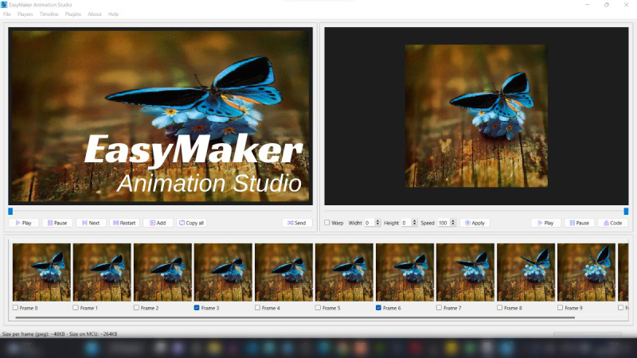
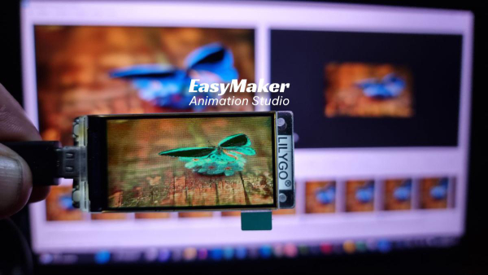

# EasyMaker-AS
EasyMaker Animation Studio - Create animations for PC (gif, webp and apng) or MCUs

Create, convert and modify existent animated images, such as GIF, WEBP and APNG in your computer.

## Create
Create an animated image using a sequence of images from your computer. You can create animated gif, webp or apng for web, social media or to send by telegram and whatsapp.

## Convert
Change the format between any of these animated image formats. A gif can be transformed in a webp, apng or again, gif renamed.

## Modify
Change the dimensions and desired number of frames. Your animation can be turned slightly in their size, can be applied deformation and speed!

## Animation for MCUs

The best resource for makers that love RGB displays and MCUs! Create an animation for RGB displays such as ILI9341, ST7789 and so on.
The program will generate a frame sample, an animation header to include in your sketch and an example sketch. Just copy the sketch and header and flash your microcontroller! It's ready to use!

## How to use this program
The usage is really very easy! Just download the installer in [releases](https://github.com/DjamesSuhanko/EasyMaker-AS/releases). Install and open the program. Now, you can watch [this video](https://youtu.be/3nGWqujnzlQ) showing all resources!
Related articles are available in [Manual do Maker](https://www.manualdomaker.com/). Just search for "EasyMaker" in the  "Search" box.
